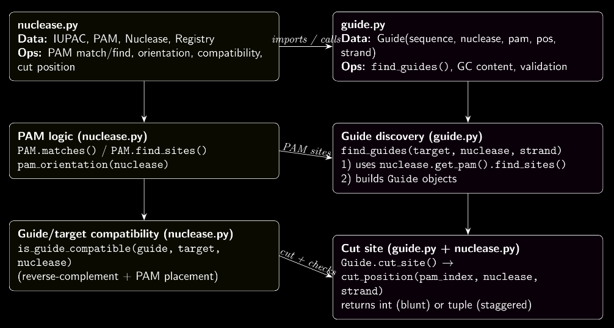

# Geneops

Unified Python toolkit for genome editing workflows: CRISPR, base editing, and prime editing.
Design guides, score off-targets, model edit outcomes, and analyze results through a consistent.

---

## What is Geneops?

Geneops is an open-source Python library that provides shared core primitives and pipelines for
genome editing tasks, including:

- CRISPR guide RNA design
- Off-target discovery and scoring
- Nuclease and PAM constraint modeling
- Edit outcome prediction (indels, base edits, prime edits)
- QC and downstream analysis
 
# Install
```
# Create virtual env
python -m venv venv
source venv/bin/activate

# Install geneops
pip install -e .
```

## Map

Overview of the current geneops architecture and how its core modules connect from guide design and nuclease modeling through edit outcome prediction and analysis. etc...



---

Contributions are welcome! Please open issues or pull requests on the GitHub repository.

Contact: ntfargo@proton.me